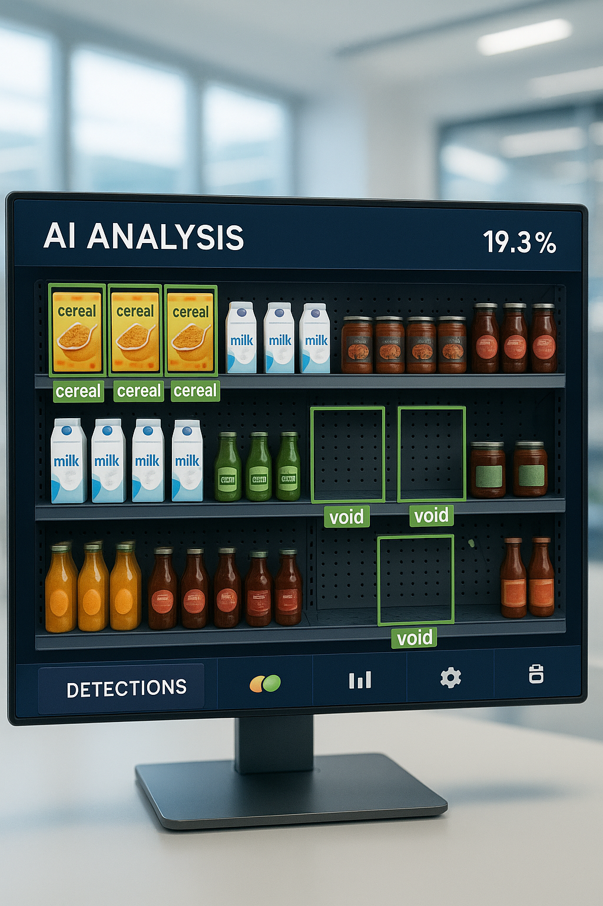

Bienvenue dans la documentation de Mon Projet !
===============================================

Analyse de la Disponibilité en Rayon (OSA)
===========================================

Notre Équipe
------------

Ce projet innovant a été réalisé par une équipe d'étudiants passionnés par l'intelligence artificielle et ses applications pratiques dans le secteur du retail, sous la supervision d'un expert reconnu dans le domaine.

Membres de l'équipe
~~~~~~~~~~~~~~~~~~~

- **Es-safi Abderrahman** – AI and Data Technologies Engineering student   
  `LinkedIn <https://www.linkedin.com/in/abderrahman-es-safi-773739329/>`__

- **Faris Amine** – AI and Data Technologies Engineering student    
  `LinkedIn <https://www.linkedin.com/in/amine-faris-645096277/>`__

Encadrant du projet
~~~~~~~~~~~~~~~~~~~

- **Pr. Tawfik Masrour** – Professor, expert IA  
  Directeur de recherche en intelligence artificielle appliquée et mentor du projet  
  `LinkedIn <https://www.linkedin.com/in/tawfik-masrour-43163b85/>`__

Filiere : IADT-SI
~~~~~~~~~

Periode : 06-2025
~~~~~~~~~
.. toctree::
   :maxdepth: 2
   :caption: Sommaire

   introduction
   modeles
   train_models_results
   Solution_1
   guide_utilisation_1
   solution_2
   guide_utilisation_2
   
