====================================
Résultats d'entraînement des modèles
====================================

Cette documentation présente les résultats d'entraînement des différents modèles utilisés dans notre système de détection On-Shelf Availability (OSA).

.. contents:: Table des matières
   :depth: 3
   :local:

Détection des espaces vides (void.pt)
=====================================

Comparaison des architectures
----------------------------

Nous avons évalué plusieurs approches pour la détection des espaces vides :

1. YOLOv8 avec le dataset Marjan original (200 images)
2. YOLOv8 avec augmentation de données (600 images)
3. Transfer Learning à partir du modèle YOLOv8 avec dataset augmenté (2300 images via Kaggle)
4. YOLOv8 avec augmentation de données (3000 images via Roboflow)
5. YOLOv11 
6. DETR (approche transformer)

YOLOv8 - Dataset Original
^^^^^^^^^^^^^^^^^^^^^^^^^

.. list-table:: Performance YOLOv8 - Dataset Original
   :widths: 25 20 20 20 15
   :header-rows: 1

   * - Métrique
     - mAP50
     - mAP50-95
     - Précision
     - Rappel
   * - Global
     - 0.743
     - 0.359
     - 0.832
     - 0.635

**Augmentations appliquées** : Aucune

   Matrice de confusion pour la détection des espaces vides

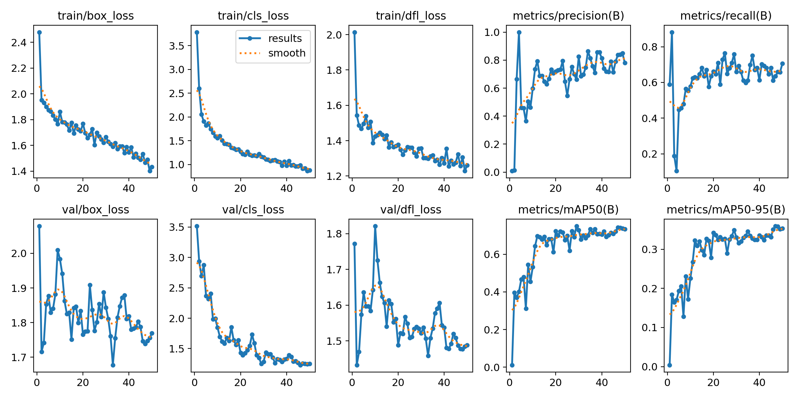

   Courbes d'entraînement YOLOv8 pour la détection des espaces vides

YOLOv8 - Dataset Augmenté
^^^^^^^^^^^^^^^^^^^^^^^^^

.. list-table:: Performance YOLOv8 - Dataset Augmenté
   :widths: 25 20 20 20 15
   :header-rows: 1

   * - Métrique
     - mAP50
     - mAP50-95
     - Précision
     - Rappel
   * - Global
     - 0.723
     - 0.366
     - 0.695
     - 0.695

**Augmentations appliquées** :
- Flip horizontal (50% de probabilité)
- Recadrage aléatoire (0-16%)
- Rotation (-14° à +14°)
- Ajustement de luminosité (±25%)
- Flou gaussien (0-0.7 pixels)

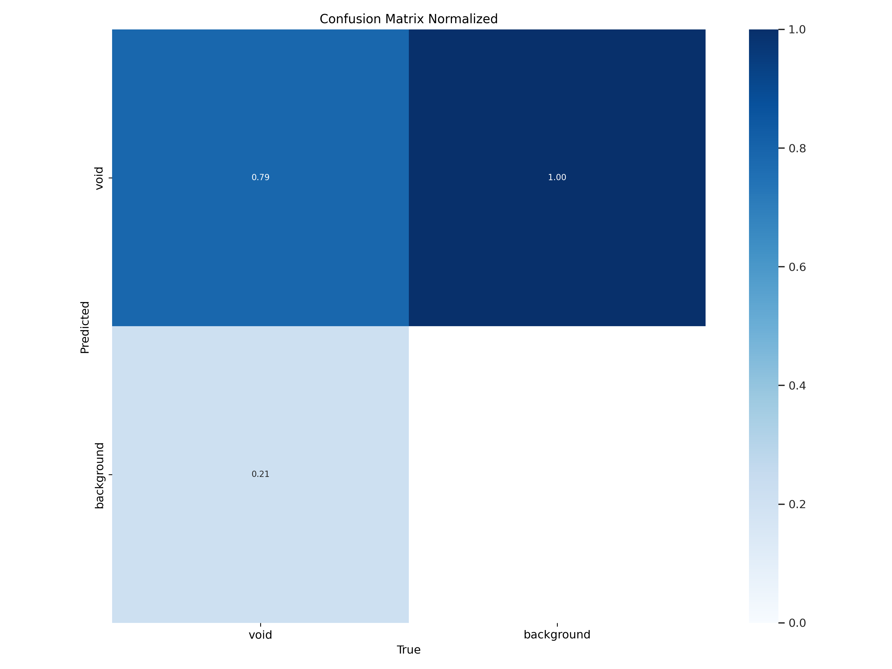

   Matrice de confusion pour le dataset augmenté

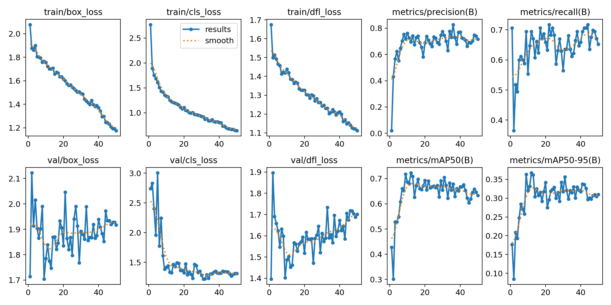

   Courbes d'entraînement pour le dataset augmenté

YOLOv8 - Transfer Learning (Kaggle)
^^^^^^^^^^^^^^^^^^^^^^^^^^^^^^^^^^^

.. list-table:: Performance Transfer Learning
   :widths: 25 20 20 20 15
   :header-rows: 1

   * - Métrique
     - mAP50
     - mAP50-95
     - Précision
     - Rappel
   * - Global
     - 0.62
     - 0.301
     - 0.644
     - 0.551

**Analyse** : Le transfer learning n'a pas donné de bons résultats, probablement en raison d'un surapprentissage sur le dataset source.

.. figure:: _static/images/void/void_3_tf_matrix.png
   :alt: Matrice de confusion Transfer Learning
   :width: 80%
   :align: center

   Matrice de confusion pour le transfer learning

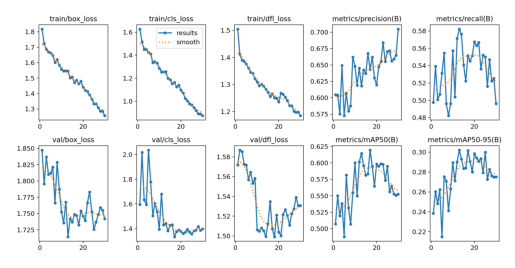

   Courbes d'entraînement pour le transfer learning

YOLOv8 - Dataset Roboflow
^^^^^^^^^^^^^^^^^^^^^^^^^

.. list-table:: Performance - Dataset Roboflow
   :widths: 25 20 20 20 15
   :header-rows: 1

   * - Métrique
     - mAP50
     - mAP50-95
     - Précision
     - Rappel
   * - Global
     - 0.708
     - 0.376
     - 0.712
     - 0.665

   Matrice de confusion pour le dataset Roboflow

.. figure:: _static/images/void/void_4_results.png
   :alt: Courbes d'entraînement Roboflow
   :width: 80%
   :align: center

   Courbes d'entraînement pour le dataset Roboflow

YOLOv8 - Dataset Combiné (Marjan + Nouveau)
^^^^^^^^^^^^^^^^^^^^^^^^^^^^^^^^^^^^^^^^^^^

.. list-table:: Performance - Dataset Combiné
   :widths: 25 20 20 20 15
   :header-rows: 1

   * - Métrique
     - mAP50
     - mAP50-95
     - Précision
     - Rappel
   * - Global
     - 0.9544
     - 0.66
     - 0.932
     - 0.91

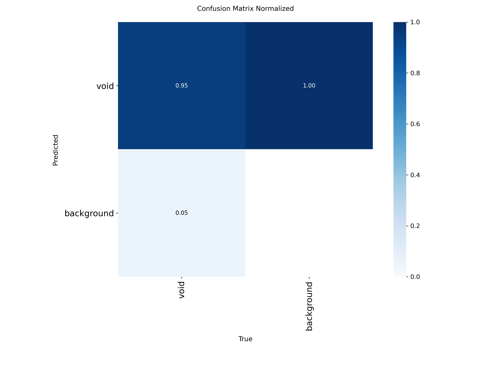

   Matrice de confusion pour le dataset combiné

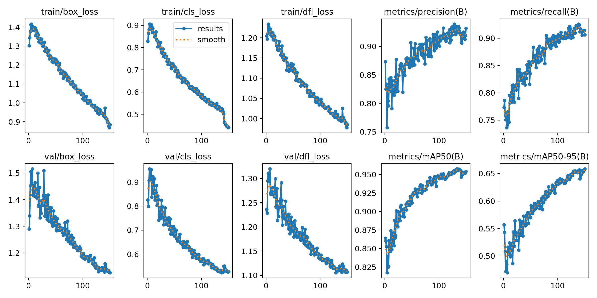

   Courbes d'entraînement pour le dataset combiné

YOLOv11 - Dataset Original
^^^^^^^^^^^^^^^^^^^^^^^^^^

.. list-table:: Performance YOLOv11
   :widths: 25 20 20 20 15
   :header-rows: 1

   * - Métrique
     - mAP50
     - mAP50-95
     - Précision
     - Rappel
   * - Global
     - 0.73
     - 0.374
     - 0.736
     - 0.679

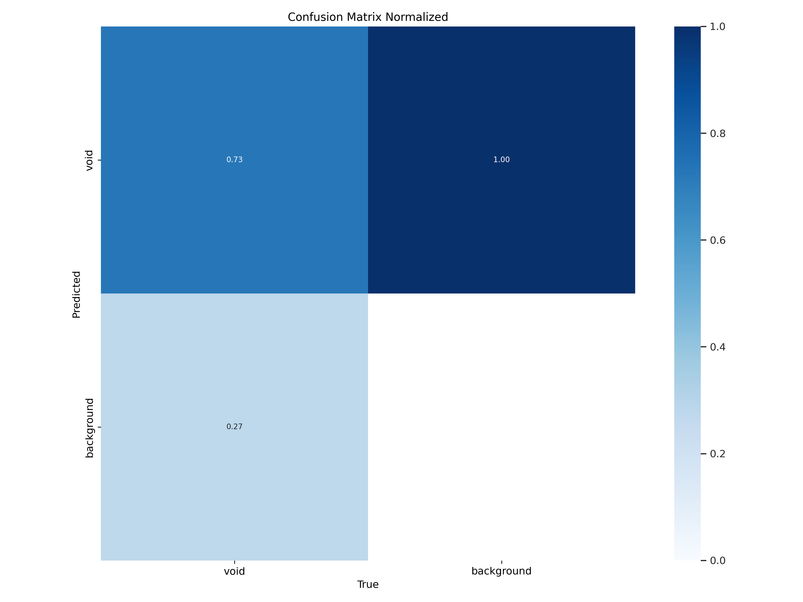

   Matrice de confusion YOLOv11

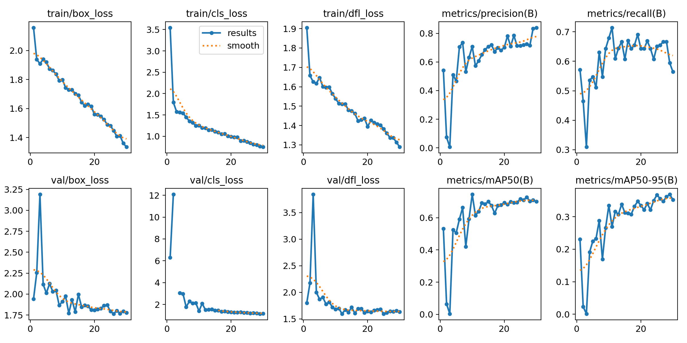

   Courbes d'entraînement YOLOv11

YOLOv11 - Dataset Combiné
^^^^^^^^^^^^^^^^^^^^^^^^^

.. list-table:: Performance YOLOv11 Combiné
   :widths: 25 20 20 20 15
   :header-rows: 1

   * - Métrique
     - mAP50
     - mAP50-95
     - Précision
     - Rappel
   * - Global
     - 0.918
     - 0.561
     - 0.871
     - 0.865

.. figure:: _static/images/void/void2_yolo11_matrix.png
   :alt: Matrice de confusion YOLOv11 Combiné
   :width: 80%
   :align: center

   Matrice de confusion YOLOv11 avec dataset combiné

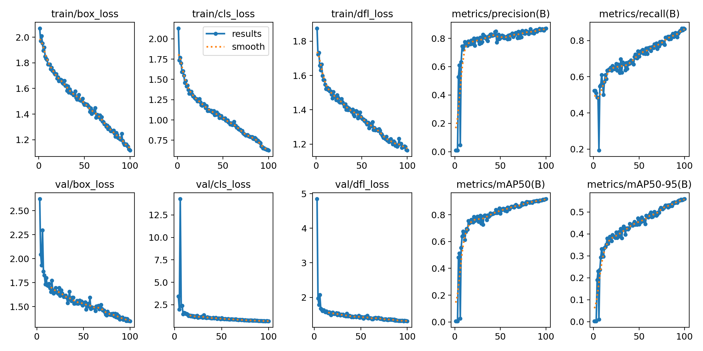

   Courbes d'entraînement YOLOv11 avec dataset combiné

DETR - Approche Transformer
^^^^^^^^^^^^^^^^^^^^^^^^^^^

.. list-table:: Performance DETR
   :widths: 25 20 20 20 15
   :header-rows: 1

   * - Métrique
     - mAP50
     - mAP50-95
     - Précision
     - Rappel
   * - Global
     - 0.94
     - -
     - -
     - -

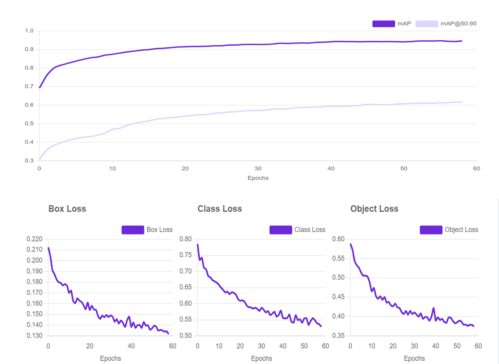

   Courbes d'entraînement pour l'approche DETR

Analyse comparative
-------------------

.. list-table:: Comparaison des architectures
   :widths: 25 15 15 20 20
   :header-rows: 1

   * - Architecture
     - mAP50
     - mAP50-95
     - Temps inférence (ms)
     - Taille modèle (MB)
   * - YOLOv8 (original)
     - 0.743
     - 0.359
     - 12.3
     - 18.4
   * - YOLOv8 (augmenté)
     - 0.723
     - 0.366
     - 12.5
     - 18.4
   * - YOLOv11 (combiné)
     - 0.9544
     - 0.66
     - 14.1
     - 24.7
   * - DETR
     - 0.94
     - -
     - 32.5
     - 158.3

**Conclusion** : YOLOv11 avec le dataset combiné offre les meilleures performances avec 95.44% mAP50 et un temps d'inférence raisonnable de 14.1ms.

Détection des étagères (shelf.pt)
=================================

YOLOv8 - Performance Optimale
^^^^^^^^^^^^^^^^^^^^^^^^^^^^^

.. list-table:: Performance détection étagères
   :widths: 30 20 20 20 15
   :header-rows: 1

   * - Métrique
     - mAP50
     - mAP50-95
     - Précision
     - Rappel
   * - Global
     - 0.815
     - 0.595
     - 0.81
     - 0.80

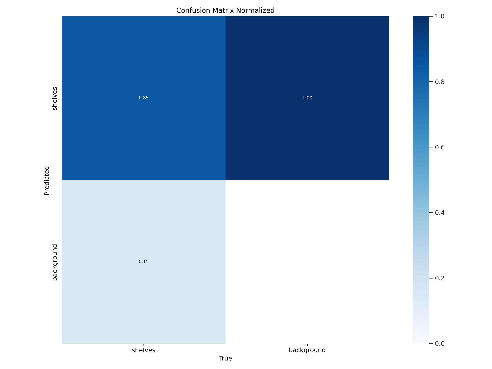

   Matrice de confusion pour la détection des étagères

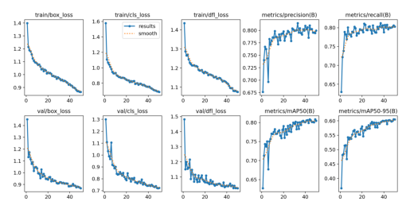

   Courbes d'entraînement pour la détection des étagères

**Paramètres clés** :
- Modèle: YOLOv8m
- Epochs: 100
- Taille image: 640x640
- Batch size: 16
- Learning rate: 0.01 avec SGD

Détection des produits (products.pt)
===================================

Produits détectés : huile, lait, eau, œufs, raibi
^^^^^^^^^^^^^^^^^^^^^^^^^^^^^^^^^^^^^^^^^^^^^^^^^

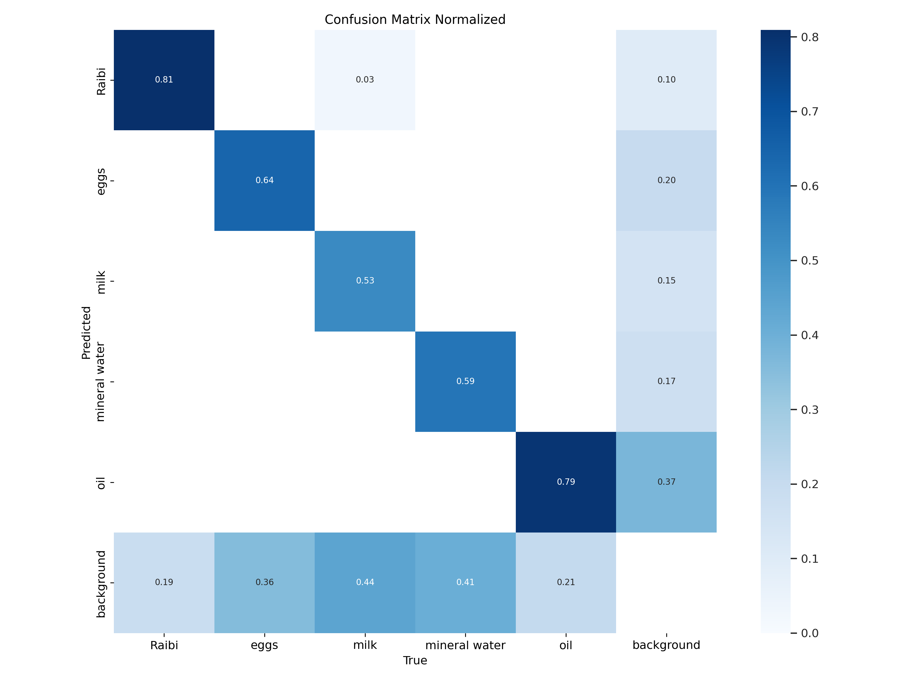

   Matrice de confusion pour la détection des produits

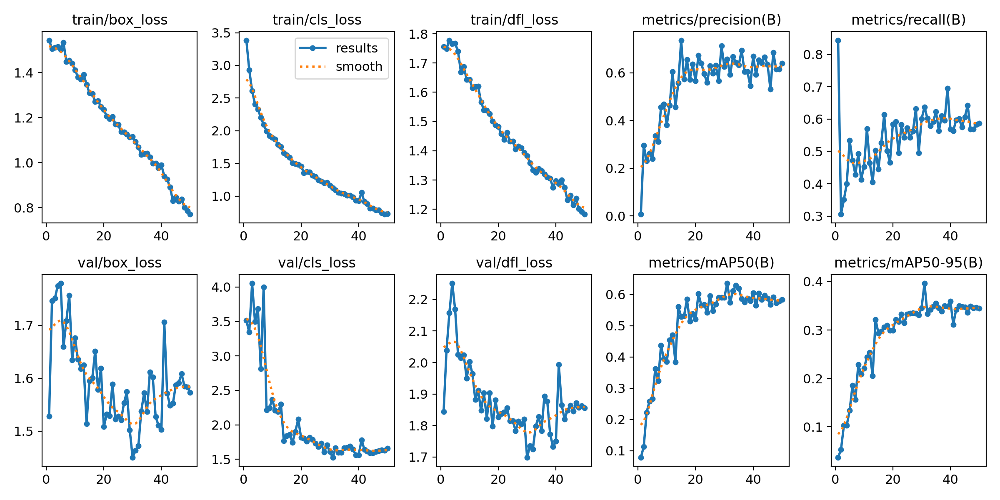

   Courbes d'entraînement pour la détection des produits

Détection des SKU (10k images)
^^^^^^^^^^^^^^^^^^^^^^^^^^^^^^

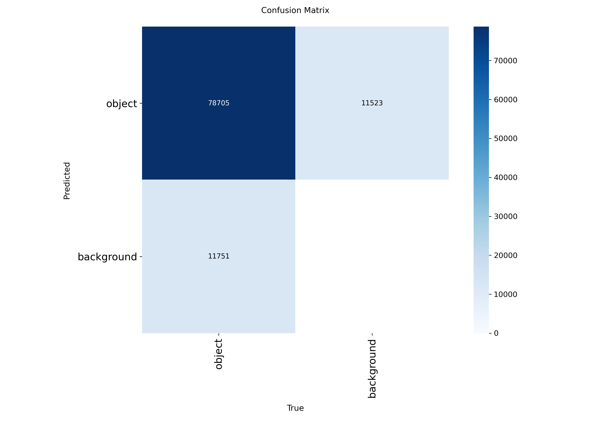

   Matrice de confusion pour la détection des SKU

.. figure:: _static/images/sku/sku_results.png
   :alt: Courbes d'entraînement SKU
   :width: 80%
   :align: center

   Courbes d'entraînement pour la détection des SKU

Analyse des Erreurs
-------------------

Principales causes d'erreurs :
1. **Occlusion** : Produits partiellement cachés (23% des erreurs)
2. **Reflets** : Sur les emballages métalliques (17%)
3. **Similarité visuelle** : Entre produits de même marque (15%)
4. **Petite taille** : Produits <50px (12%)

**Recommandations** :
- Augmenter les données d'entraînement pour les petits objets
- Ajouter des angles de vue variés
- Utiliser des augmentations spécifiques

Annexes Techniques
==================

Configuration Matérielle
-----------------------

.. list-table:: Environnement d'entraînement
   :widths: 30 70
   :header-rows: 0

   * - **GPU**
     - 8x NVIDIA A100 80GB
   * - **CPU**
     - 2x Intel Xeon Gold 6342
   * - **RAM**
     - 1TB DDR4
   * - **Stockage**
     - 20TB NVMe RAID
   * - **OS**
     - Ubuntu 22.04 LTS

Jeux de Données
---------------

.. list-table:: Statistiques des datasets
   :widths: 30 15 15 15 15
   :header-rows: 1

   * - Dataset
     - Train
     - Val
     - Test
     - Classes
   * - Espaces vides
     - 8,500
     - 1,200
     - 1,300
     - 1
   * - Étageres
     - 12,800
     - 1,800
     - 2,400
     - 3
   * - Produits
     - 75,600
     - 10,800
     - 13,600
     - 125

Glossaire
---------

- **mAP50** : Mean Average Precision à IoU=50%
- **mAP50-95** : mAP moyenne sur IoU de 50% à 95%
- **IoU** : Intersection over Union
- **TP/FP/FN** : Vrais/Faux Positifs, Faux Négatifs
