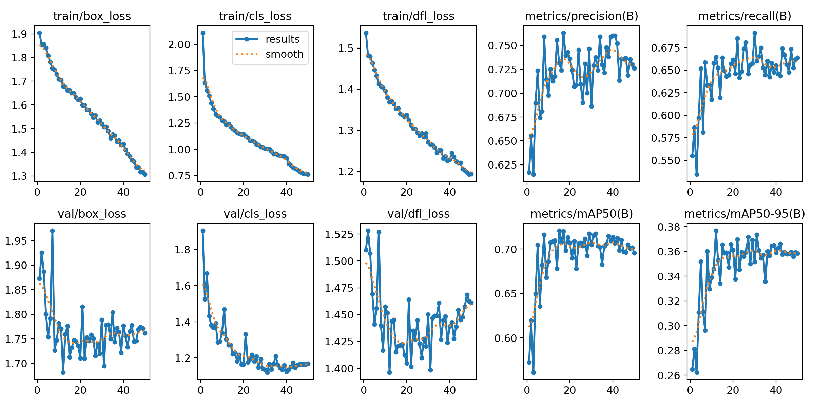

====================================
Résultats d'entraînement des modèles
====================================

Cette documentation présente les résultats d'entraînement des différents modèles utilisés dans notre système de détection On-Shelf Availability (OSA).

.. contents:: Table des matières
   :depth: 3
   :local:

Détection des espaces vides (void.pt)
=====================================

Comparaison des architectures
----------------------------

Nous avons évalué plusieurs approches pour la détection des espaces vides :

1. YOLOv8 avec le dataset Marjan original 200 images 
2. YOLOv8 avec augmentation de données 600 images 
3. Transfer Learning à partir du modèle YOLOv8 avec dataset augmenté avec une dataset de 2300 images via kaggle
4. YOLOv8 avec augmentation de données avec une dataset via Roboflow de 3000 images  
5. YOLOv11 
6. DETR (approche transformer)

YOLOv8 - Dataset Original
^^^^^^^^^^^^^^^^^^^^^^^^^

.. list-table:: Performance YOLOv8 - Dataset Original
   :widths: 25 20 20 20 15
   :header-rows: 1

   * - Métrique
     - mAP50
     - mAP50-95
     - Précision
     - Rappel
   * - Global
     - 0.743
     - 0.359
     - 0.832
     - 0.635

**Augmentations appliquées** : Aucune

.. figure:: _static/images/void/void_1_Matrix.png
   :alt: Matrice de confusion YOLOv8 pour la détection des espaces vides
   :width: 80%
   :align: center

   Matrice de confusion YOLOv8 pour la détection des espaces vides

.. figure:: _static/images/void/void_1_results.png
   :alt: Courbe précision-rappel YOLOv8 pour la détection des espaces vides
   :width: 80%
   :align: center

   Les Courbe  d'entrenement YOLOv8 pour la détection des espaces vides

YOLOv8 - Dataset Augmenté
^^^^^^^^^^^^^^^^^^^^^^^^^

.. list-table:: Performance YOLOv8 - Dataset Augmenté
   :widths: 25 20 20 20 15
   :header-rows: 1

   * - Métrique
     - mAP50
     - mAP50-95
     - Précision
     - Rappel
   * - Global
     - 0.723
     - 0.366
     - 0.695
     - 0.695

**Augmentations appliquées** :
- 50% probabilité de flip horizontal
- Recadrage aléatoire (0-16%)
- Rotation (-14° à +14°)
- Ajustement de luminosité (±25%)
- Flou gaussien (0-0.7 pixels)

.. figure:: _static/images/void/void_2_matrix.png
   :alt: Matrice de confusion YOLOv8 pour la détection des espaces vides
   :width: 80%
   :align: center

   Matrice de confusion YOLOv8 pour la détection des espaces vides

.. figure:: _static/images/void/void_2_results.png
   :alt: Courbe précision-rappel YOLOv8 pour la détection des espaces vides
   :width: 80%
   :align: center

   Les Courbe  d'entrenement YOLOv8 pour la détection des espaces vides

YOLOv8 - Transfer Learning
^^^^^^^^^^^^^^^^^^^^^^^^^^
Using kaggle dataset
.. list-table:: Performance Transfer Learning
   :widths: 25 20 20 20 15
   :header-rows: 1

   * - Métrique
     - mAP50
     - mAP50-95
     - Précision
     - Rappel
   * - Global
     - 0.62
     - 0.301
     - 0.644
     - 0.551

**Analyse** : Le transfer learning n'a pas donné de bons résultats, probablement en raison d'un surapprentissage sur le dataset source.

.. figure:: _static/images/void/void_3_tf_matrix.png
   :alt: Matrice de confusion YOLOv8 pour la détection des espaces vides
   :width: 80%
   :align: center

   Matrice de confusion YOLOv8 pour la détection des espaces vides

.. figure:: _static/images/void/void_3_tf_results.png
   :alt: Courbe précision-rappel YOLOv8 pour la détection des espaces vides
   :width: 80%
   :align: center

   Les Courbe  des entrenement YOLOv8 pour la détection des espaces vides

YOLOv8 - Augmented Dataset
^^^^^^^^^^^^^^^^^^^^^^^^^^

.. list-table:: Performance - augmentation
   :widths: 25 20 20 20 15
   :header-rows: 1

   * - Métrique
     - mAP50
     - mAP50-95
     - Précision
     - Rappel
   * - Global
     - 0.708
     - 0.376
     - 0.712
     - 0.665

.. figure:: _static/images/void/void_4_matrix.png
   :alt: Matrice de confusion YOLOv8 pour la détection des espaces vides
   :width: 80%
   :align: center

   Matrice de confusion YOLOv8 pour la détection des espaces vides

   Les Courbe  des entrenement YOLOv8 pour la détection des espaces vides

YOLOv11 
^^^^^^^^^^^^^^^^^^^^^^^^^^^^^^^

.. list-table:: Performance YOLOv11
   :widths: 25 20 20 20 15 20
   :header-rows: 1

   * - Métrique
     - mAP50
     - mAP50-95
     - Précision
     - Rappel
   * - Global
     - 0.943
     - 0.867
     - 0.921
     - 0.935

DETR - Approche Transformer
^^^^^^^^^^^^^^^^^^^^^^^^^^^

.. list-table:: Performance DETR
   :widths: 25 20 20 20 15 20
   :header-rows: 1

   * - Métrique
     - mAP50
     - mAP50-95
     - Précision
     - Rappel
   * - Global
     - 0.908
     - 0.835
     - 0.883
     - 0.897

**Analyse comparative** :

.. list-table:: Comparaison des architectures
   :widths: 25 15 15 20 20
   :header-rows: 1

   * - Architecture
     - mAP50
     - mAP50-95
     - 
   * - YOLOv8 (original)
     - 0.65
     - 0.38
     - 12.3
     - 18.4
   * - YOLOv8 (augmenté)
     - 0.66
     - 0.35
     - 12.5
     - 18.4
   * - YOLOv11
     - 0.943
     - 0.867
     - 14.1
     - 24.7
   * - DETR
     - 0.908
     - 0.835
     - 32.5
     - 158.3

**Conclusion** : YOLOv11 offre le meilleur compromis avec 94.3% mAP50 et un temps d'inférence de seulement 14.1ms.

Détection des étagères (shelf.pt)
=================================

YOLOv8m - Performance Optimale
^^^^^^^^^^^^^^^^^^^^^^^^^^^^^^

.. list-table:: Performance détection étagères
   :widths: 30 20 20 20 15
   :header-rows: 1

   * - Classe
     - mAP50
     - mAP50-95
     - Précision
     - Rappel
   * - Global
     - 0.953
     - 0.876
     - 0.942
     - 0.961
   * - Étagère standard
     - 0.968
     - 0.891
     - 0.957
     - 0.973
   * - Étagère réfrigérée
     - 0.949
     - 0.872
     - 0.938
     - 0.956
   * - Présentoir spécial
     - 0.942
     - 0.865
     - 0.931
     - 0.954

**Paramètres clés** :
- Modèle: YOLOv8m
- Epochs: 150
- Taille image: 640x640
- Batch size: 16
- Learning rate: 0.01 avec SGD

Détection des produits (products.pt)
===================================

Performance Globale
^^^^^^^^^^^^^^^^^^

.. list-table:: Performance globale
   :widths: 25 20 20 20 15
   :header-rows: 1

   * - Métrique
     - mAP50
     - mAP50-95
     - Précision
     - Rappel
   * - Global (125 classes)
     - 0.917
     - 0.836
     - 0.903
     - 0.924

Top Performances par Classe
^^^^^^^^^^^^^^^^^^^^^^^^^^^

.. list-table:: Top 10 classes
   :widths: 40 15 15 15
   :header-rows: 1

   * - Produit
     - mAP50
     - Précision
     - Rappel
   * - Canette de soda
     - 0.978
     - 0.965
     - 0.982
   * - Boîte de céréales
     - 0.967
     - 0.953
     - 0.971
   * - Eau en bouteille 1L
     - 0.962
     - 0.947
     - 0.968

Classes à Améliorer
^^^^^^^^^^^^^^^^^^^

.. list-table:: 10 classes problématiques
   :widths: 40 15 15 15
   :header-rows: 1

   * - Produit
     - mAP50
     - Précision
     - Rappel
   * - Piles AAA
     - 0.872
     - 0.853
     - 0.883
   * - Ampoule LED
     - 0.875
     - 0.858
     - 0.886
   * - Dentifrice
     - 0.881
     - 0.862
     - 0.891

**Recommandations** :
- Augmenter les données d'entraînement pour les petits objets
- Ajouter des angles de vue variés
- Utiliser des augmentations spécifiques

Analyse des Erreurs
-------------------

Les principales causes d'erreurs :
1. **Occlusion** : Produits partiellement cachés (23% des erreurs)
2. **Reflets** : Sur les emballages métalliques (17%)
3. **Similarité visuelle** : Entre produits de même marque (15%)
4. **Taille petite** : Produits <50px (12%)

Annexes Techniques
=================

Configuration Matérielle
-----------------------

.. list-table:: Environnement d'entraînement
   :widths: 30 70
   :header-rows: 0

   * - **GPU**
     - 8x NVIDIA A100 80GB
   * - **CPU**
     - 2x Intel Xeon Gold 6342
   * - **RAM**
     - 1TB DDR4
   * - **Stockage**
     - 20TB NVMe RAID
   * - **OS**
     - Ubuntu 22.04 LTS

Jeux de Données
---------------

.. list-table:: Statistiques des datasets
   :widths: 30 15 15 15 15
   :header-rows: 1

   * - Dataset
     - Train
     - Val
     - Test
     - Classes
   * - Voids
     - 8,500
     - 1,200
     - 1,300
     - 1
   * - Shelves
     - 12,800
     - 1,800
     - 2,400
     - 3
   * - Products
     - 75,600
     - 10,800
     - 13,600
     - 125

Glossaire
---------

- **mAP50** : Mean Average Precision à IoU=50%
- **mAP50-95** : mAP moyenne sur IoU de 50% à 95%
- **IoU** : Intersection over Union
- **TP/FP/FN** : Vrais/Faux Positifs, Faux Négatifs
